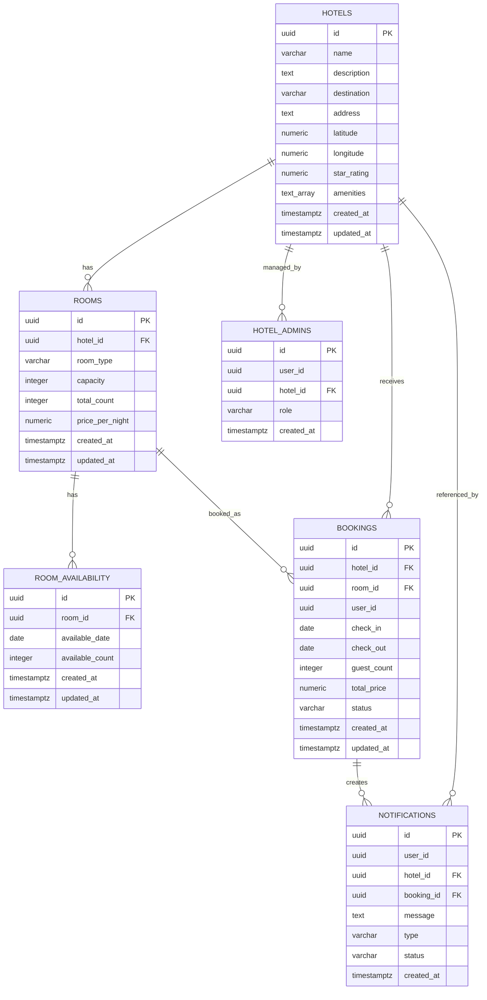

# Data Models and ER Diagram

The main relational data model is stored in Supabase PostgreSQL. Comments are intentionally stored separately in AWS DynamoDB, and hotel detail cache entries are stored in Upstash Redis.

## Supabase PostgreSQL ER Diagram



## DynamoDB Comments Model

Table: `hotel_comments`

Recommended access pattern:

- Partition by `hotelId`
- Sort by `createdAt`

Item shape:

```json
{
  "commentId": "uuid",
  "hotelId": "uuid",
  "userId": "uuid",
  "overallRating": 4.5,
  "serviceRatings": {
    "cleanliness": 5,
    "location": 4,
    "staff": 5,
    "comfort": 4
  },
  "comment": "Great hotel with clean rooms and good location.",
  "createdAt": "2026-05-01T12:00:00Z"
}
```

## Upstash Redis Cache Model

Hotel detail cache key:

```text
hotel:details:{hotelId}
```

Rules:

- Cache only unfiltered hotel detail responses.
- Do not cache availability-sensitive responses when `checkIn`, `checkOut`, or `guests` filters are present.
- Store base, undiscounted responses and apply logged-in discount per request.

## RabbitMQ Message Model

Queue:

```text
reservation.created
```

Message shape:

```json
{
  "bookingId": "uuid",
  "hotelId": "uuid",
  "roomId": "uuid",
  "userId": "uuid",
  "checkIn": "2026-07-15",
  "checkOut": "2026-07-18",
  "guestCount": 2,
  "totalPrice": 630.00,
  "createdAt": "2026-05-11T12:00:00Z"
}
```
